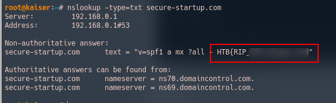
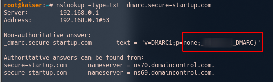

# Easy Phish

### Challenge Author(s): [greenwolf](https://app.hackthebox.eu/users/110957)

### Description: 
    Customers of secure-startup.com have been recieving some very convincing phishing emails, can you figure out why?
### Difficulty: `Easy`

---
# Challenge

Let's check the given website first. It looks like the domain is owned by GoDaddy and is for sale. Let's use `dig` to find more about the TXT DNS record of the site.

Check [here](https://linuxincluded.com/testing-spf-dkim-and-dmarc/) for refernce.

```bash 
nslookup -type=txt secure-startup.com
```


We find half of the flag so we check for DKIM and DMARC records too. 

```bash
nslookup -type=txt _dmarc.secure-startup.com
```



We get the the whole flag concatenating the 2 strings.