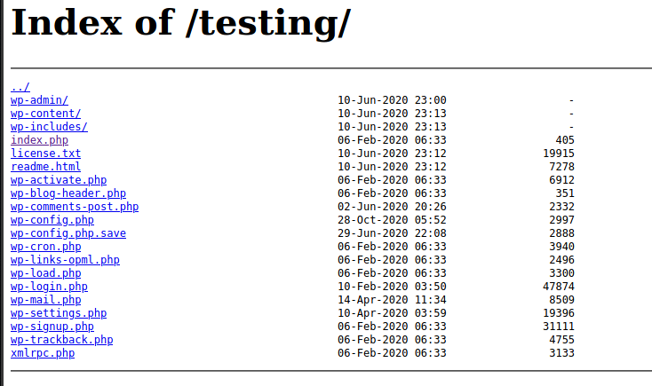
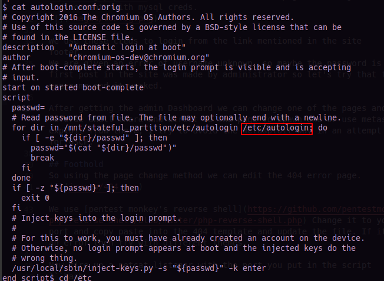

# Spectra
### Machine Maker(s): [egre55](https://app.hackthebox.eu/users/1190)

#### Info :
``` 
OS          : Linux
Difficulty  : Easy
Points      : 20
IP          : 10.10.10.229
```
---
## Enumeration
Let's start by scanning the ip using nmap 
```bash
nmap -A 10.10.10.229
```

We find an open ssh port            
When we go to the ip in the browser we are shown 2 links which redirect to spectra.htb, so we add them to the `/etc/hosts` file
```bash
echo "10.10.10.229 spectra.htb" >> /etc/hosts
```

Now going to one of the links we find out that it's a sample wordpress site.
Clicking on the test link we get an error


In the url removing the `index.php` we can see the testing directory


The wp-config file is an important one for wordpress sites as they store db creds, so we open `wp-config.php` but we get an error so we next try `wp-config.php.save` we are faced with a blank page, checking the source we ind comments with mysql creds. 
          

We use these creds to login from the link mentioned in the site footer.         
We are given an error of username unknown, so maybe the password is valid. The first post in the site was made by administrator so let's try that for username and it worked.

After getting the admin Dashboard we can change one of the pages and add our reverse shell there and direct to the page to spawn one or use metasploit and exploit from there, I try to avoid the metasploit way in an attempt to prepare for OSCP.

## Foothold
So using the page change method we can edit the 404 error page.


We use [pentest monkey's reverse shell](https://github.com/pentestmonkey/php-reverse-shell/blob/master/php-reverse-shell.php) Change it to your ip and port and copy paste into the 404 template and update the file. If it's showing an error then try with different themes.

Now fire up a netcat listener with the port you put in the script
```bash
nc -lvnp 1234
```
Now navigate to that url
`http://spectra.htb/main/wp-content/themes/twentyseventeen/404.php`

and we get our shell in the netcat listener.

## Privilege Escalation                

We are the nginx user in the shell, there's another user katie with `user.txt` in their home directory which we don't have permission to read.

Enumerating further we find some autologin sctip in `/opt` directory.



Now we navigate to `/etc/autologin and find a password`


For some reason the switch user command wasn't working, so tried to SSH with the user Katie and the password we found.

```bash
ssh katie@10.10.10.229
```
It worked and we can cat the user.txt for the user flag.

Let's first check for the commands we can run as root.
```bash
sudo -l
```


I couldn't find anything about this in gtfo bins. So I googled it.

I found this [link](https://isharaabeythissa.medium.com/sudo-privileges-at-initctl-privileges-escalation-technique-ishara-abeythissa-c9d44ccadcb9) briefing on how to get root, So I followed it.

You can follow the steps from the link to get privilege escalataion and we get the root flag.

